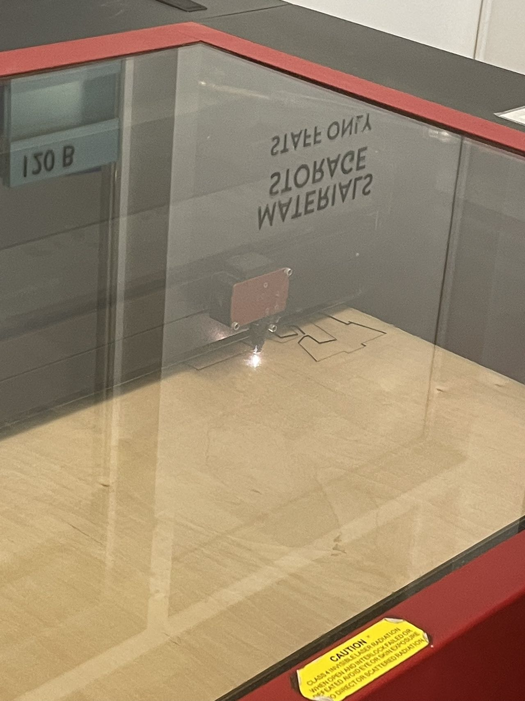
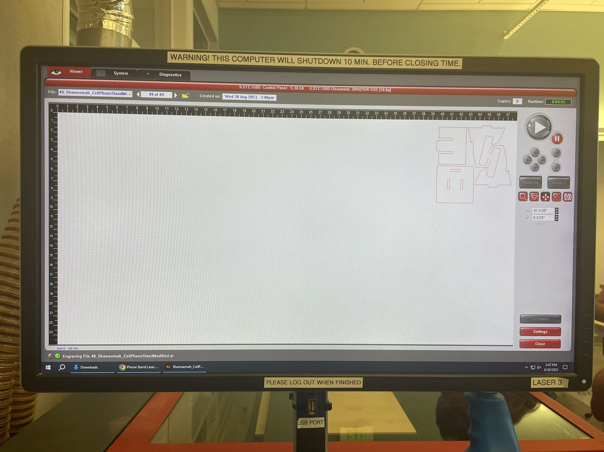
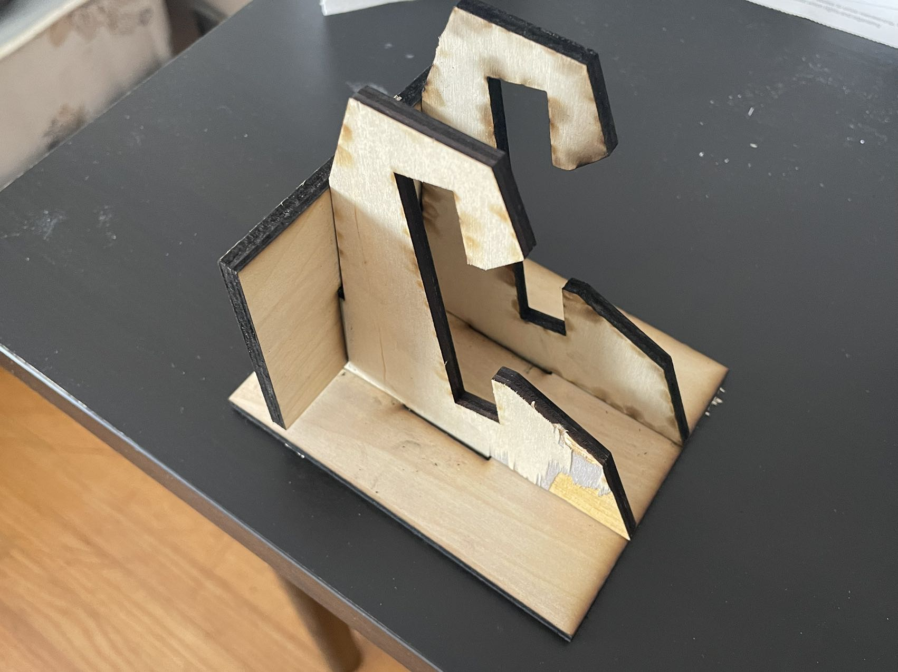

# Report 1 - Week of 08/28/2023

## Overview
This week I've been mainly focusing on fimiliarizing myself with Github, Rhino, 3D printing and laser cutting, and managed to produce a cell phone stand using a laser cutter. I hope to learn more about and become comfortable with using Rhino and Grasshopper in the following weeks.

## Design
I tweaked the parameters of the orginal design to fit my phone after measuring the width, height, and thickness of my phone. And one thing that I've learnt is that you can't make the gap of the phone stand exactly the size of yourn phone for it would be difficult to put in, take out or adjust the position of your phone in tha case, and neither can you leave the gap too big as the stand wouldn't be able to hold the phone stably. Finding that sweet spot is crucial. Also, I always thought that I understand "user-centered design" well as a UX designer, but making a physical product just takes this term to another level. The design is comletely driven by and revolves around the user, which, in our case, is the size of their phone.

## Production
After converting what I had in Rhino to an Illustrator file, I went to the studio and laser-cutted it. I learnt two techniques that can guarantee the machine cutting through your material: adjusting the parameters through pre-testing, and simply cutting the material multiple times.

## Result
Using the second method mentioned above, I got my stand! It's not perfect, but good enough for me for the first try.

## Reflection
I believe that documenting contextual observations including user preferences, ergonomics, market trends, and aesthetic considerations can help refine the design process and ensure the resulting cell phone stands meet the intended requirements. And apart from the visual appeal and functionality of the cell phone stands, other evaluations can be conducted to provide valuable feedback. This feedback may involve user testing, usability evaluations, and durability assessments, namely putting the product into use in realistic, specific scenarios where the user can interact with and test it to see if it meets their needs and expectations.

Moreover, in terms of where AI can fit in this process, it can be utilized for generating novel design suggestions and initial design concepts based on user preferences, or analyzing large datasets of cell phone stand designs to identify patterns and optimize parameters. This approach can enhance the efficiency and effectiveness of the design process.
