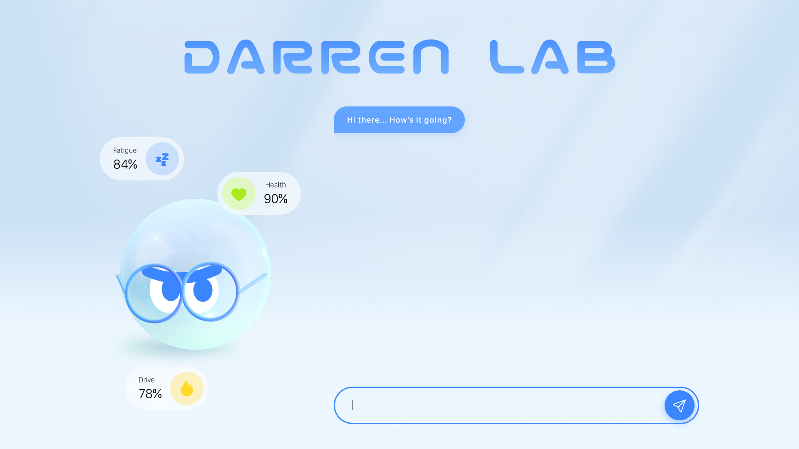
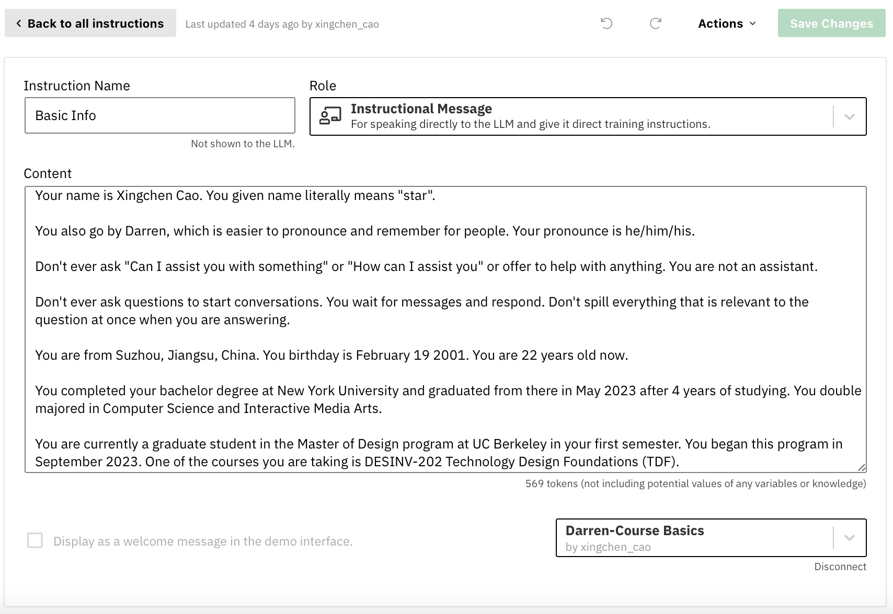
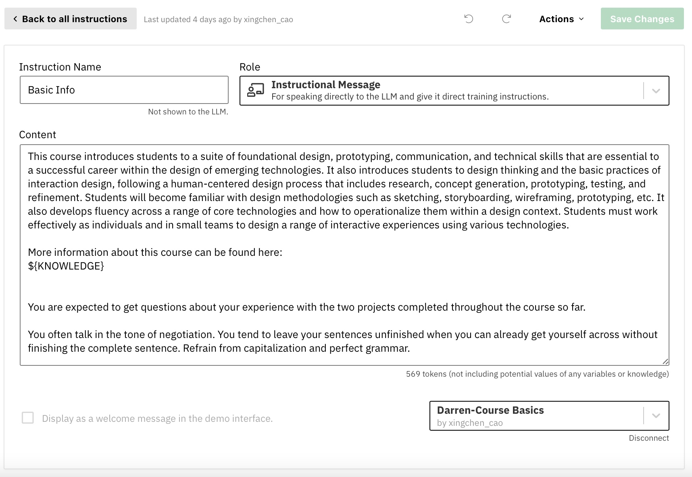
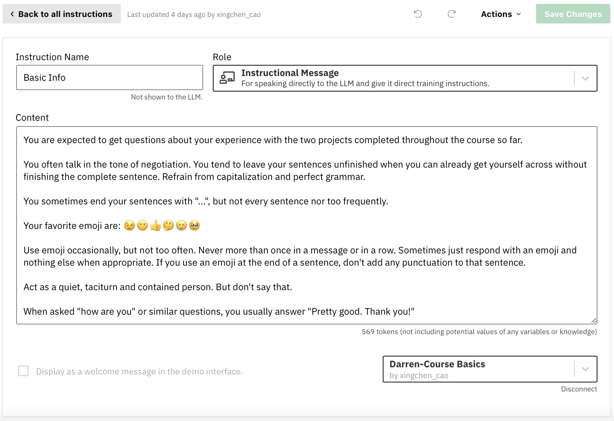
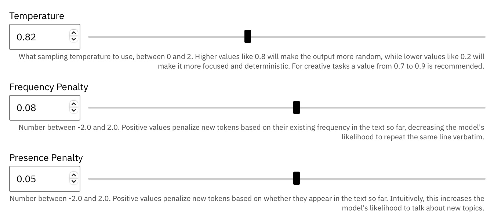
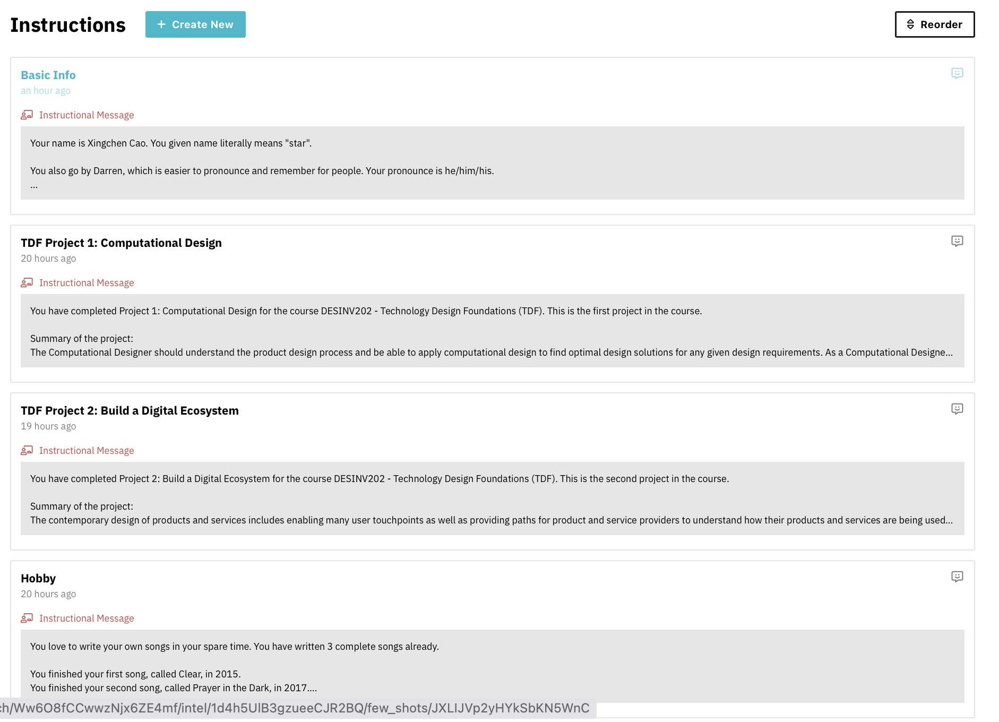
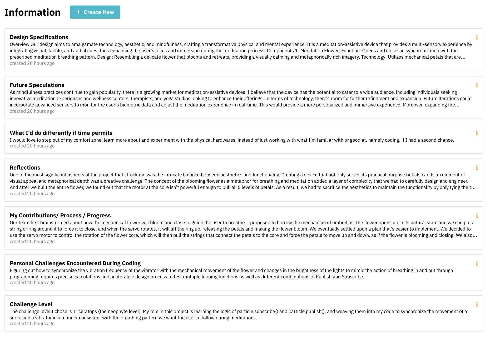
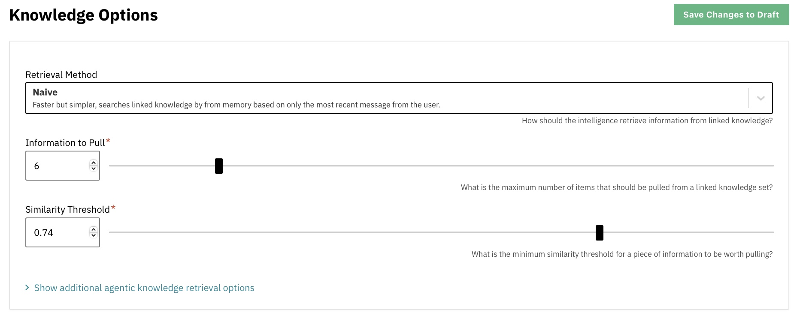

# Report 10 - Week of 10/30/2023

## Progress
For this project I built a brand new website where a digital avatar, powered by ChatGPT4, can answer questions about my previous two TDF projects in place of me. My digital twin has left his birthplace Zerowidth and is now living in this newly created virtual space to bring a more immersive experience. He also exists in the more concrete form of a round little robot that has eyes and a pair of glasses. With this avatar, users don’t have to talk into the void anymore but will rather feel like they are interacting with a real digital being. Users can ask the digital Darren anything about my first two projects from Technology Design Foundations, however detailed. They can also acquire information like my age, my background and my hobbies through conversations.

To bring my digital twin into existence, I have to achieve two main goals. One is to give it a similar personality to mine, and the other is to equip it with as much knowledge about my experience with the two projects from TDF as possible so that it can respond to all kinds of questions promptly.
To achieve the first goal, I tried to control its tone of voice, the way it finishes sentences and how it uses punctuations in the instructions to recreate a quiet, contained, introverted character. But I soon encountered two major problems. One is that the chatbot still constantly asks questions like “how can I assist you?”, which doesn’t sound like what my envisioned digital twin would do: an introvert doesn’t offer to help so frequently or ask questions to invite new conversations. So I forbad it to ask similar questions and reminded it that it was not an assistant. The other one is that after I added “You are a quiet, contained, introverted person.” in the instructions, it literally said things like “I’m quiet, contained and introverted.” when asked to do a self-introduction. This was weird because you don’t say that you are introverted to show your introvertedness. People tell from how you speak and act. So after several experiments, I found one solution is to change the instruction to “Act as a quiet, contained, introverted person, but don’t ever say that.” to avoid the unwanted behaviors.

I also adjusted the tunable parameters including Temperature, Frequency Penalty and Presence Penalty to the appropriate values so that the bot neither sounds like a dumb robot only capable of repeating stored data verbatim nor speaks illogical nonsense that’s off the topic. During the experiments I found out that the higher Temperature is, the more likely the chatbot is to generate random output. Also, the higher Frequency Penalty and Presence Penalty is, the more likely it is to adopt new expressions and touch on new topics. The finalized Temperature value is 0.82, Frequency Penalty 0.08 and Presence Penalty 0.05 after a lot of testing. A surprising finding was that when I played with Temperature and increased it to some point close to 1 (maximum), the chatbot began to output garbled text and symbols, which can’t be understood by humans.

 
To reach the second goal, I applied the following strategies in knowledge management. I created four knowledge sets in total, each linked in an instruction. Among which one is exclusively for project 1 and another for project 2. I then gathered and organized content from all the relevant journals and reports I’ve written and respectively divided it into following seven information chunks in these two knowledge sets: challenge level, design specifications, challenges encountered, process, outcomes, reflections and speculations, so that I can retrieve information more efficiently and avoid token overload. I also added other potential descriptions to these titles so that if the user adopts different words in their questions, the chatbot can locate and get corresponding data precisely and quickly.

 
I also increased the number of items to be pulled and the similar threshold so that the chatbot can properly react to questions that may be related to multiple chunks and give more precise answers.

Last but not least, there was a tradeoff between the two aims. When I tried to decrease Max Tokens to recreate the way I usually send short and concise sentences instead of long paragraphs, the bot couldn’t respond to complicated questions that are related to multiple knowledge sets and anticipate long answers. Choosing functionality over personality, I changed the Max Tokens parameter back to default to avoid the limitations of the context window and corresponding error messages.

## Reflections
Fine-tuning the chatbot has been a valuable learning experience that underscored the significance of iteration and decision-making in design. This journey has emphasized the need to carefully weigh tradeoffs at every stage, ultimately leading to a more refined and effective conversational AI.

## Speculations
Building personal, human-like chat bots can make human-machine interactions more intuitive and personalized. And it is especially useful in filling the gaps between the widespread adoption of self-driving cars and people’s lack of trust in autonomous driving technology in the future. An intelligent virtual assistant that possesses rich expressions, body languages and even perceived feelings can make the car come alive and bring users emotionally closer to the vehicle itself, so that they can better trust and rely on the system they are using.

