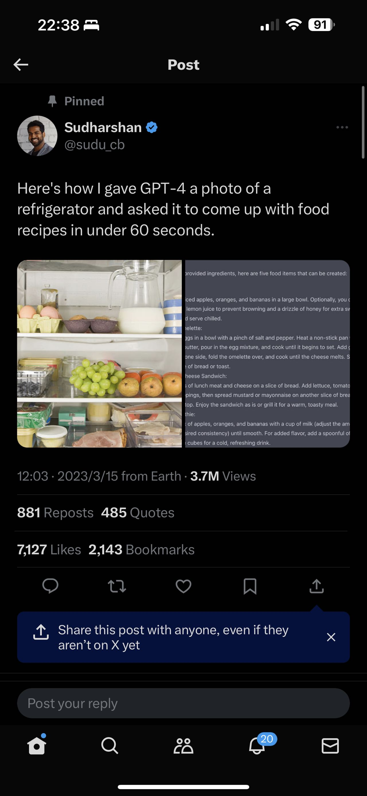

# Report 12 - Week of 11/13/2023

## Progress
I've wanted to keep working on my Project 3 and build something more refined and useful for the final project. Below is my proposal.

Summary
CurioUX Hub is an interactive UX library powered by Generative Large Language Models aimed at beginners in UX or UX practitioners looking to build and enhance their personal knowledge base. The platform will enable users to ask questions about basic UX/UI concepts, update their knowledge sets by uploading website links and fragmented post content, and engage in quizzes to assess their understanding. The goal is to provide an immersive and dynamic learning experience in the field of UX through the application of LLM-based AI.

Research Plan
1. User Needs: Find out what types of information my target users need most through simple interviews and surveys.
2. Interaction Design: Experiment with different ways users can engage with the AI-driven UX library, including conversational interfaces and quiz interactions, and form a clear understanding of what kinds of interaction are feasible based on the tools I have.
3. Updating Mechanisms: Investigate methods for integrating and collecting user feedback or prompts of adding new knowledge into the database to enhance the platform's effectiveness and personalization.

Current Work
During Project 3, I have already formed a basic understanding of how to manage knowledge and influence conversations in fine-tuning LLM-based AI. I have also acquired some experience building a brand new interactive website that can be connected to Zerowidth through API calls, though the website can only handle the very first prompt from the user, which I think may be related to the lack of manually maintaining the status and sessions of the conversations. I will overcome the encountered technical hurdles, particularly those related to API integration and web development and create a working product rather than a prototype.

Motivation
1. Further enhance understanding and application of LLM-based AI in educational technology by managing a larger amount of knowledge and more complicated interaction modes.
2. Improve my web development skills by solving the technical challenges left from Project 3 and building a working website this time.
3. Hone my 3D modeling skills through creating 3D UI assets that will be used in the website to make it more immersive and visually appealing.

Challenge Level
Platypus

Timeline
Week 1 (11/13 - 11/19)
􏰀 Find out and organize all the information the target user group needs the most
  Create corresponding knowledge sets and build a functional intelligence
􏰀 Implement the initial set of quiz functionalities

Week 2 (11/20 - 11/26)
􏰀 Design the UI for the final website, including the 3D assets
􏰀 Debug the website from Project 3 and build a working website

Week 3 (11/27 - 12/4)
􏰀 Conduct user testing to detect and fix unnoticed problems
􏰀 Solicit feedback during the demonstration for further improvement and iterations

## Reflections & Speculations
On Monday's class, I noticed that Cynthia's proposal is similar to mine in that we both want to combine AI and web development to build a sophisticated product that's tailored to a specifc need. But her idea is developing an app that recommends Chinese herbal cuisine to users accoridng to different needs, which is more interesting. So I decided to team up with her and work one her project.

And this is what we found. We thought that we could design our app in a similar way.

