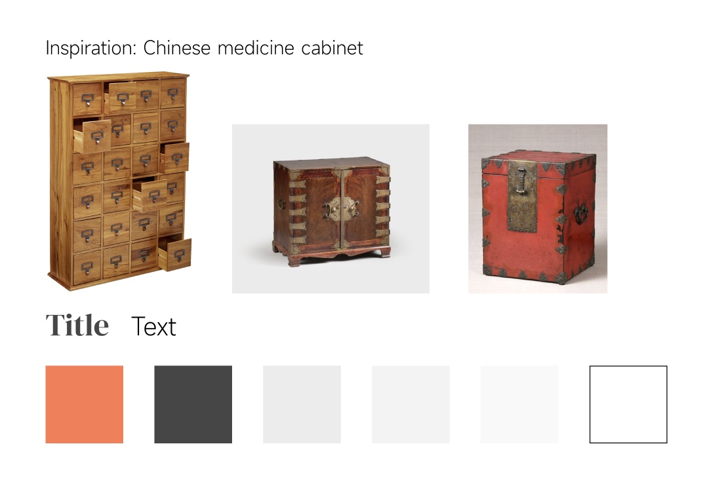
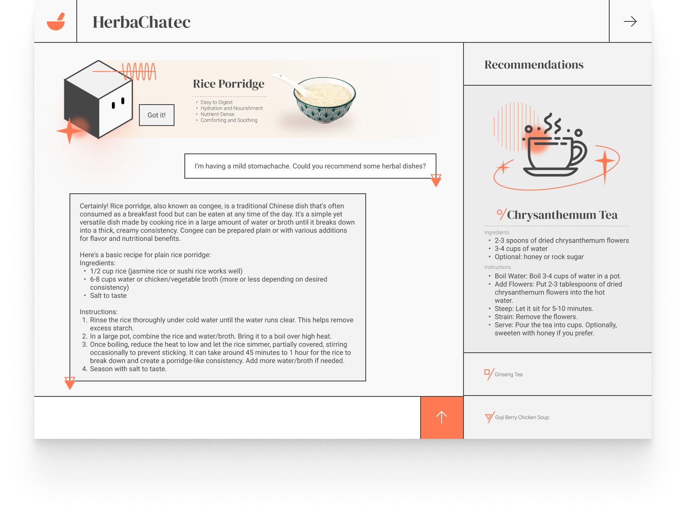

# Report 13 - Week of 11/27/2023

## Progress
I've been designing the user interface for our project. Inspired by the rectangular form of Chinese medicine cabinets, I decided to apply a grid system to sturcture and made our chat bot a cute little cube. I also used orange as the theme color, integrating the brown of the cabinets and the red that represents Chinese culture.

I've been also translating what I designed in Figma into a working webpage using html, css and javascript.

