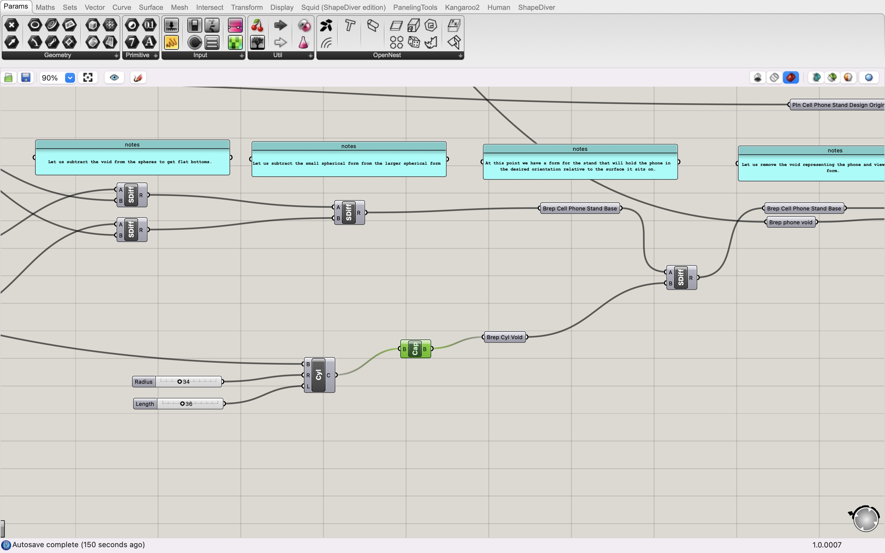
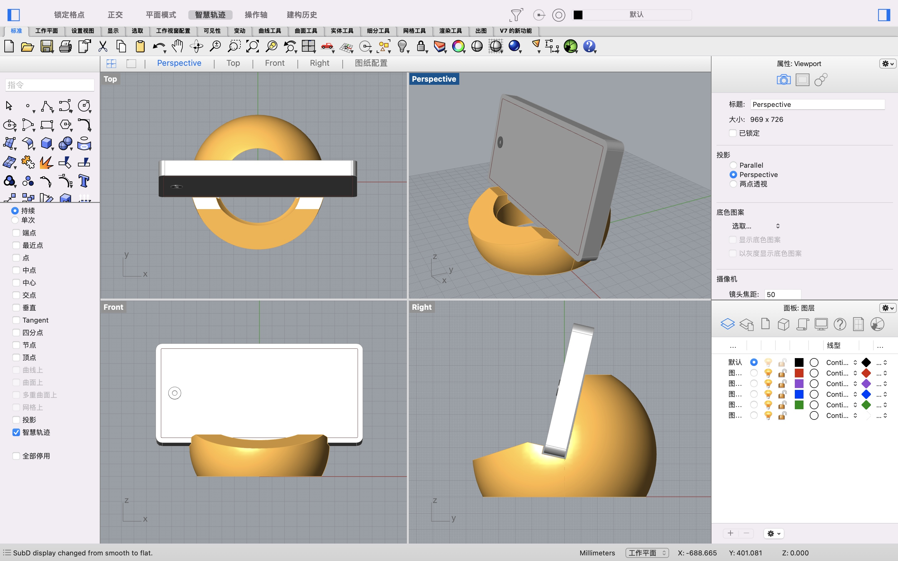
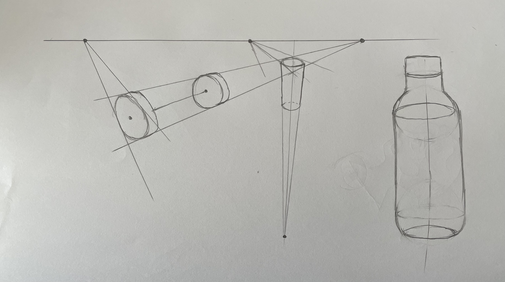

# Report 2 - Week of 09/04/2023

## Progress
Throughout this week, I made some progress in advancing my proficiency in Rhino and Grasshopper. And I achieved the following accomplishments:

1. I continued my self-learning by studying more tutorials from platforms like Bilibili and Youtube on Rhino and Grasshopper. These resources were instrumental in helping me comprehend essential concepts and techniques, providing a solid foundation for my project.

2. To tailor the phone stand to my specific needs, I gathered precise data about my phone by measuring the width, height, and thickness of the phone within its phone case. This data was then applied to fine-tune the parameters within the provided Grasshopper file. The result was a customized phone stand that fits my device perfectly, which I believe will offer a seamless user experience.

3. In an attempt to make my design more sustainable and eco-friendly, I made a practical modification. I introduced a cylinder void within the model, strategically placed to reduce the material needed during the 3D printing process.

4. In parallel with my digital work, I also spent time enhancing my sketching skills as a beginner by repeating the basic exercises.

## Reflections
This week's experiences engendered quite some reflections.

1. Through my experiences, I had a taste of the huge potential of a design system compared to a singular design approach. The inherent flexibility and adaptability of a design system became evident as I tailored the phone stand to my specific requirements. This systematic thinking offers designers a much higher level of customization and adaptability.

2. A crucial observation emerged during this week's work: the fundamental difference between constructing 3D models through computational methods, such as by adjusting parameters and relationships of objects in Grasshopper, and direct manipulation in a graphical user interface. While computational methods works better in precision and suitability for real-world applications, GUI-based approaches thrive in artistic expression and the creation of visually captivating scenes like games or website banners, serving different design intents.

## Speculations
Looking ahead, I anticipate several exciting directions and speculations for the future:

1. I am preparing for further refinements to the phone stand model, considering adding space that can accommodate charging cables or phone case lanyards, especially in scenarios where users need to position their phones vertically.

2. I'm also eagerly looking forward to experimenting with new aesthetic elements in my designs. These creative explorations aim to make the phone stand more visually unique or interesting, enhancing its overall appeal.

3. When the design is ready, I will print it out.
