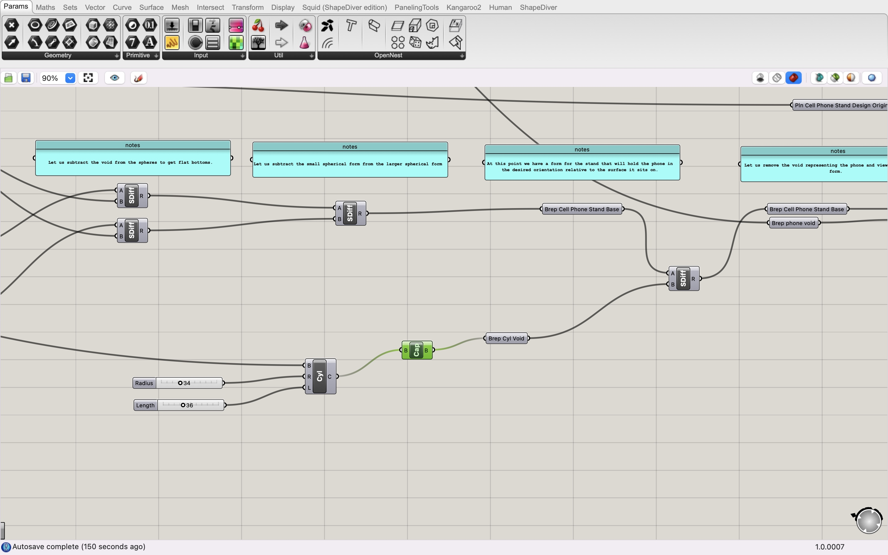

# Report 3 - Week of 09/11/2023

## Progress
I've made some major changes to my design. To create more unique and personalized cell phone stand, I basically redeigned it from scratch. The process is as follows.

1. The new design is inspired by The Myth of Sisyphus, where he is condemned by the gods to roll a boulder up a hill for all eternity, only to have it roll back down each time he nears the top. I find this myth fascinating because the repetitive and seemingly futile task serves as a representation of my life, where I often struggle to seek breakthroughs and meaning in the meaningless everyday mundane. And I envision my cell phone to be one of the boulders I’m pushing: I spend a lot of time on it every day, maybe too much, I’d say. It’s a temporary escape from reality, an excuse to avoid small talks with strangers in an elevator, and most importantly, a device on which most of the things I do are meaningless, draining my energy. I try to spend less time on it, hoping to accomplish things that are more meaningful than browsing through social media posts and playing video games, but I just can’t live without it. And that’s how my cell phone stand comes into shape, where there's a little figure extending both arms forward, pushing and supporting the cell phone.

2. Then I started building it using Grasshopper.I first analyzed what the stand would consist of and broke it down into 7 parts: the head, the body, two arms, two legs and the base. After I constructed those parts one be one separately using basic geometric shapes: spheres, boxes and cylindars, I tried to combine them together in to an integrated whole. This where I encountered one of my biggest challenges. I initially used "Merge" but found that the exported model couldn't be sliced by Cura. I searched online and figured out that maybe "Solid Union" was the correct command, and it worked. That's when I understand the difference bewteen them.

3. The final design looks something like this. And now I'm waiting for it to be printed.

## Reflections
1. Now I understand the difference between "Merge" and "Solid Union": When you use "Merge," the input geometries are simply grouped together into a list. They remain as separate entities within the list, and their individual properties and identities are retained. When you use "Solid Union," the input solids or closed surfaces are combined in a way that they merge into a single, continuous solid. Any overlapping or intersecting parts are resolved, and the final result is a watertight, solid object.

2. Don't be afraid to try or experiment in something you are new with. Learn while you do. Often times things are a lot more easier than they appear.

## Speculations
1. I anticipate that the tools we use for computational design, such as Rhino and Grasshopper, will continue to evolve rapidly. One prominent trend is the integration of AI and machine learning into these platforms. We're already seeing AI-assisted design suggestions, generative algorithms, and even AI-driven fabrication processes. I believe this integration will become more seamless, making it easier for designers to harness the power of AI in their projects. Additionally, the cloud will play a significant role in the future of computational design. Cloud computing enables collaborative design processes, real-time simulations, and data-driven insights. We'll likely see more plugins and extensions that leverage cloud resources for complex calculations and simulations, further expanding the capabilities of these tools.

2. As for the future of my work in computational design, I see a couple of exciting directions. Firstly, I plan to explore further personalization in design. The design of my cell phone stand project, which draws inspiration from personal experiences and preferences, has shown me the potential of tailoring designs to individual needs. I believe this trend of personalized and emotionally resonant designs will continue to gain momentum, and I want to be at the forefront of it.
