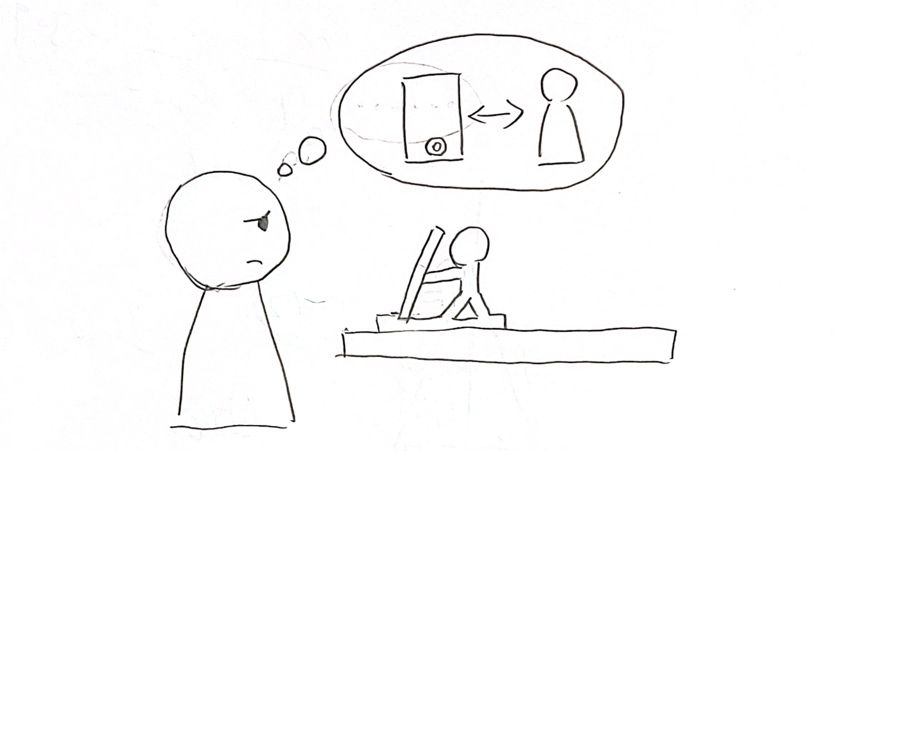

# Report 4 - Week of 09/18/2023

## Progress
I received valuable feedback from the video presentation session last week. The feedback highlighted the importance of user customization and interactivity. In response, I modified the Grasshopper file to enable users to tilt their phones to a preferred viewing angle. This adjustment not only showcases the flexibility of computational design but also addresses the practical needs of users who may want to adjust their phone's position for comfort and usability.

Having overcome all the hurdles I encountered along the way, I managed to create a working cell phone stand model with a Grasshopper file like this.

In this file you can manipulate the design by adjusting the phone size, tilting the phone to a certain degree and changing how much of the screen you want to see through numeric inputs. You can also adjust the thickness of each part of the little figure as well as the size of the entire stand by controlling the sliders. All the parameters in the current file are a result of meticulous calculations based on the size of my own cell phone.
   
After printing it out and putting the prototype to test, I found my phone perfectly placed on it and I could easily watch Tik Tok with only one finger to swipe up and down instead of using my hand to hold it all the time.

Finally, I have managed to follow steps 1-4 in the given Photon2 tutorial, set up my device and acquired the MAC address. Things went pretty smoothly. 

## Reflections
I have also taken my peers' comments to heart regarding the consideration of actual use cases. By incorporating suggestions and insights gained from the video presentation session, I now understand the significance of achieving a balance between general user needs and personal aesthetics. While my initial design was inspired by personal experiences and metaphors, I am eager to further refine my project to accommodate a wider range of user preferences and practical applications. This includes exploring additional use cases, such as video conferencing, reading, or cooking with instructional videos, to ensure that my design resonates with a broader audience.

## Speculations
The design of my cell phone stand holds potential for interesting impacts on human experiences. It introduces an element of playfulness and whimsy to the act of using a smartphone. The stand, inspired by The Myth of Sisyphus, adds a layer of metaphorical depth to our interaction with technology. As users place their phones on the stand, they are reminded of the cyclical and sometimes futile nature of their digital habits. This visual cue may prompt moments of self-reflection, encouraging individuals to use their devices more intentionally.

The user reflecting the relationship between them and the object the use (their phone) through another object (the cell phone stand) as the medium
Moreover, the stand's customizable features, such as adjusting the phone size and viewing angle, enhance user convenience and comfort. By tailoring the stand to their preferences, users can create a personalized viewing experience that aligns with their unique needs and habits. This level of customization can contribute to increased user satisfaction and overall well-being.

