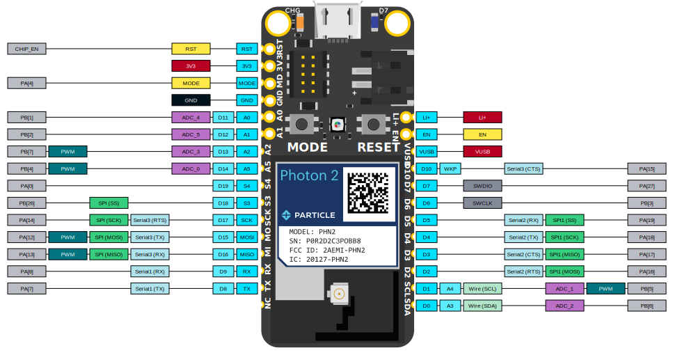
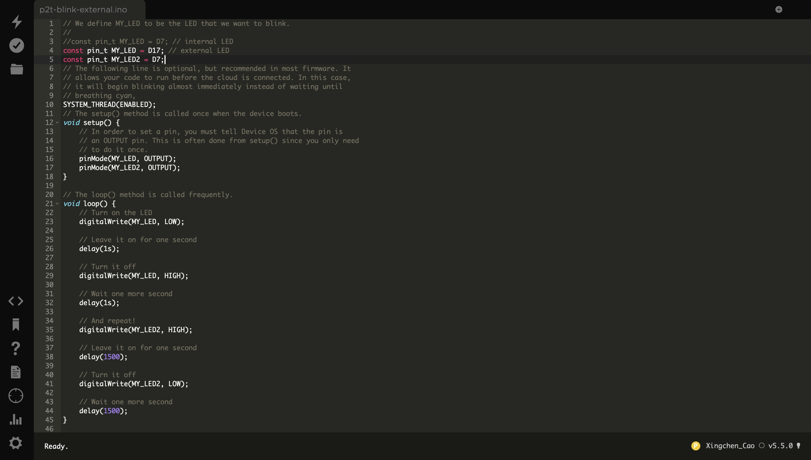

# Report 5 - Week of 09/25/2023

## Progress
1. This week, I spent time familiarizing myself with the Photon2's GPIO (General-Purpose Input/Output) pins. The knowledge is crucial for designing and prototyping various hardware components for our IoT project.

2. I also delved into the basics of LEDs and resistors. Understanding the LED polarity and resistor value is essential for creating effective and efficient circuitry. I documented my findings, including practical tips on selecting the right resistor values to ensure the longevity and brightness of the LEDs.

3. To gain practical experience, I modified and experimented with the provided code in class. Specifically, I focused on adjusting the frequency and intervals of two LEDs blinking. By altering the code, I aimed to create different lighting patterns and explore the visual impact of these changes. This hands-on experience deepened my understanding of microcontroller programming.

4. Given the theme of "home," I spent some time brainstorming ideas with my peers. One concept that piqued my interest is the integration of sensors to monitor whether the front door is locked. This could provide homeowners with peace of mind by allowing them to remotely check the status of their door's lock through a mobile app or other user interface. In addition to the door lock sensor, we also considered the potential for an innovative doorbell system. This system would use facial recognition technology to differentiate between known and unknown visitors. When someone familiar approaches the door, the doorbell would ring with a specific pattern or sound, alerting the homeowner to the presence of a friend or family member. Conversely, if an unknown person is detected, the doorbell would ring differently, potentially signaling a security concern.

## Reflections
While studying the details of GPIO pins, LEDs, and resistors might seem daunting, I found it incredibly satisfying to grasp these fundamentals. It's important to building a strong foundation for our future design work. Additionally, experimenting with the code was really enlightening, as it gave me a taste of the creative possibilities we can explore in this course.

## Speculations
I'm excited about the potential of the Particle Photon2 and the broader world of microcontrollers. As the semester progresses, I anticipate diving deeper into Arduino coding, expanding my knowledge of IoT technologies, and exploring innovative applications for our project. I'm particularly interested in investigating how IoT can enhance user experiences and solve real-world problems regarding mental issues through smart and connected devices. Additionally, I look forward to collaborating with my clasmates to complete amazing projects.
