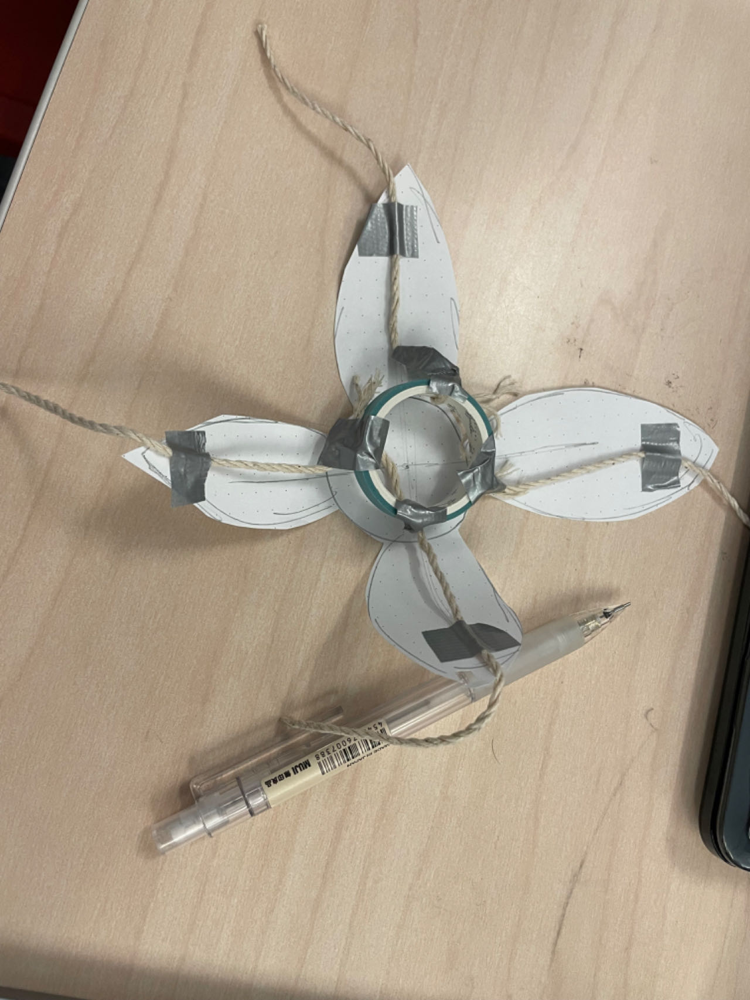
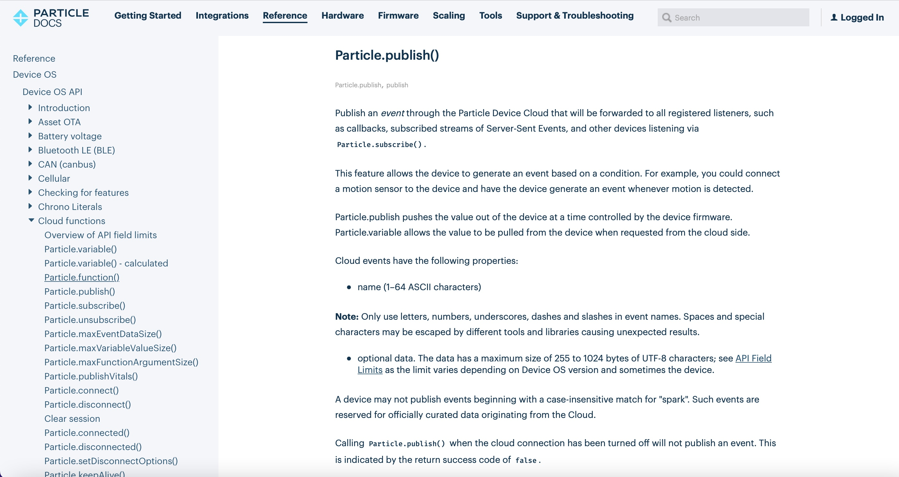

# Report 7 - Week of 10/09/2023

## Progress
This week, our team focused on figuring out the mechanism of how the flower will bloom and close to guide the user to breathe and meditate. After a heated discussion, we eventually settled upon the plan that's the easiest to implement. We decided to use the servo motor to control the rotation of the flower core, which will then pull the strings that connect the petals to the core and force the petals to move up and down, as if the flower is blooming and closing. We also made a simple prototype using tapes and paper during Monday's class to test our assumptions and it worked well. So in the following days we moved on with this idea together. The mechanical team has finished the 3D model of the flower and Adorey completed servo testing.

As a member of the coding team in our group, I spent a lot of time learning about the publish and subscribe functions, as well as the overall syntax of coding with Photon 2, as our project will need two devices to work in a synchronized way. I am completely new to Arduino or Photon, but my prior experience with p5.js come in handy at this point. The basic structures and logic are highly similar.

## Reflections
This week's experience was a learning curve for me. Nonetheless, the project's technical requirements have encouraged me to apply my existing knowledge and adapt it to this new platform. It's been a valuable opportunity to expand my coding skill set and work in a collaborative team environment.

## Speculations
Looking ahead, our team is well on track to realize our project's vision. We will continue refining the servo motor and mechanical aspects, ensuring that the flower's movements are as realistic and soothing as possible. Additionally, I will continue to strengthen my understanding of the publish and subscribe functions, which are essential for ensuring the synchronized operation of our two devices.

The upcoming week will likely involve more coding work, refining the software side of the project, and working closely with the hardware team to ensure a seamless integration of the flower's physical and digital components. Overall, I'm optimistic about our project's development and believe that we're making great strides toward achieving our goals.
