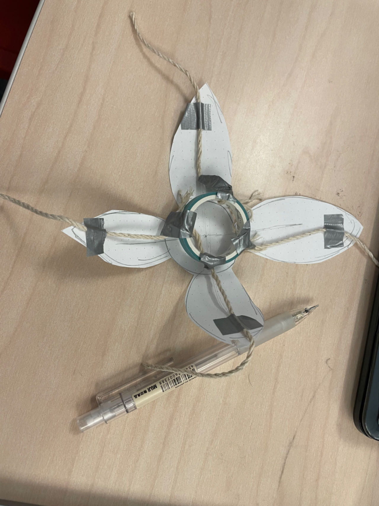

# Report 8 - Week of 10/16/2023

## Progress
After figuring out how Particle.publish() and Particle.subscribe() work and how two Photons can communicate with each other using the two functions on ourselves, we divided the following work in the coding team. Baurzhan was responsible for developing a webpage that can publish events to the two Photons in our project, and I needed to make the vibrator vibrate and the servo rotate not only in a synchronized way but also in a manner consistent with the breathing pattern we want the user to follow.

My process goes like this:
1. Having discussed with Adorey, who meditates a lot, and tried the meditation on Apple Watch myself, we decided that a reasonable breathing pattern should consist of looping cycles, where the user will inhale for 4 seconds, hold their breath for 1 second and exhale for 4 seconds, and that after each cycle there should be a half-second pulse.
2. For the vibrator, I introduced the adafruit-drv2605-photon library and picked 5 effects from all the effects the motor driver that can form a period of vibration whose frequency and intensity can change continuously after a lot of testings. To implement the inhale phase, I created a nested for loop to have the driver go through 5 effects in total, from the weakest buzzing to the strongest, and last 800ms during each effect, so that the inhale process will last 4s. After that, there's a 1s delay where the user need to hold their breath. And a similar nested for loop controls the exhale process, the only difference being the driver will go from the strongest effect to the weakest. Below is the screenshots of my code.

3. For the servo, I also have to do a precise control. The servo will need to rotate 90 degrees clockwise in exactly 4 seconds to pull the petals and make the flowers close, mimicking the action of breathing in. After 1s for holding breath, it will again rotate 90 degrees counterclockwise in exactly 4 seconds to release the petals and make the flowers bloom, mimicking the action of breathing out. What I did is calculating the time each rotation will take in order to reach 90 degrees in 4 seconds and using that to control the movement of the servo. With delays added to represent holding breath and short pulses, the code looks something like this.

The final result is shown in the recordings. Both parts work in sync and can be activated by the button in the webpage.

## Reflections
In terms of the state of our work, we have basically achieved our goal of creating a meditative device that guides users through a specific breathing pattern. We've successfully synchronized the vibrator and servo's actions with the desired breathing pattern, with vibrations mimicking the inhale and exhale phases, and the servo controlling the flower petals' movement to simulate the user's breath.

However, there is one issue we've encountered that needs further attention. When we attempt to turn off the device, it doesn't stop immediately but completes the current cycle before terminating. This behavior is not in line with our user experience goals, and we will need to investigate and resolve this issue. It's a valuable lesson in troubleshooting and refining our design for a smoother user interaction though.

## Speculations
Regarding the future direction of our work, I anticipate further refinement of our meditative device after this project. If we have time, we may explore incorporating additional sensors to monitor biometric data, providing users with real-time feedback and enhancing the meditative experience. This project's potential for growth and improvement is promising, and I'm excited to see where it leads.
