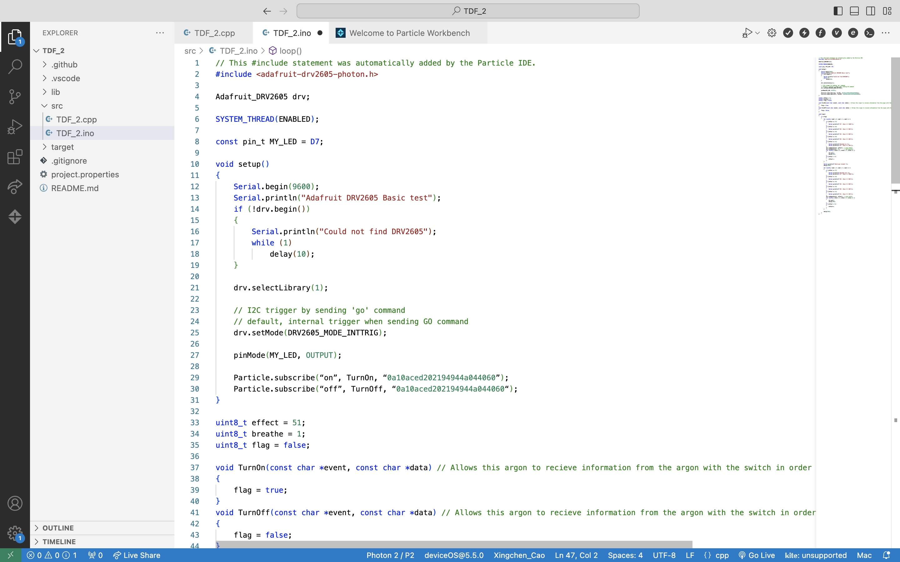
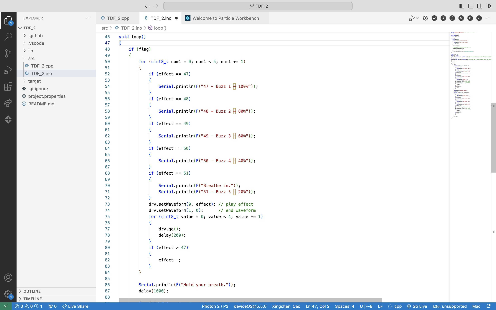

# Report 9 - Week of 10/23/2023

## Progress
This week I was introduced to this tool that helps people prototype and develop AI applications seamlessly, called Zerowidth, and have spent some time familiarizing myself and experimenting with it. I created two Intelligences and two knowledge sets.

I noticed that you can ask the bot to speak in a certain tone or style. For example, this is what I get when I put "you like to rhyme" in one instruction. Although this is helpful for recreating how a real person would talk, these extra requirements take the bot longer time to generate responses. So how to balance that is crucial.

I'm also learning what the tuning parameters do, like Temperature, Frequency Penalty and Presence Penalty. They seem to impact the model's likelihood to generate random output, talk about new topics, or repeat what's already said.

## Reflections
Tokens are a fundamental concept in chatbots and large language models. Tokens are chunks of text that language models read. In English, a token can be as short as one character or as long as one word, and it's used for various purposes. Tokens help break down text into manageable pieces for analysis and help the model understand context. When generating text, the model uses the surrounding tokens to determine what comes next in the conversation.

Models also have token limits, which restrict the length of input and output. They generate text one token at a time, with each token being influenced by the preceding context.

I need to be aware of token limitations and token usage when working with Zeroeidth, as they can impact the model's performance, cost, and your ability to craft effective interactions.

## Speculations
I would love it if Zerowidth allows creators to customize and design their own chatbot interfaces. Now we can only choose the interface type to be "conversational" or "single response" and decide whether certain information is shown. But it would be amazing if we can change the fonts, chatbox shapes and the theme colors, or even insert a virtual avatar. That could really help create unique chatbots and shape fascinating user experience.

I can also see this playing a useful role in my final project for another course of mine, Intro to User experience. We are working on solutions to help users better write propmpts to generate images that live up to their expectations through Midjourney. And we can use Zerowidth to mimic how AI can help users come up with terminologies through recommendations and auto-filling after it stores and studies numerous cases how users usually combine prompt keywords together.
